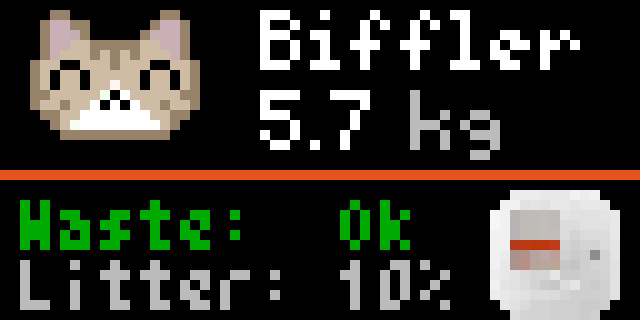

# 🐈 PETKIT Cat Litter Box Stats for Tidbyt / [Tronbyt Server](https://github.com/tronbyt/
⚠️ Recommended way: Use the script/automation via HomeAssistant with [TidbytAssistant](https://github.com/savdagod/TidbytAssistant) for automations.

😺 Needs this awesome HACS Integration to work: [home-assistant-petkit](https://github.com/RobertD502/home-assistant-petkit) 

This Pixlet applet shows recent usage statistics from your automatic litterbox  (e.g. PuraMax 1/2):

- ℹ️ Choose Device Name
- ⏲️ Choose Informations to Show
- ⚠️ Alert when Litterbox is full or Litter is empty
- 🖌️ Choose Cat Pixel Art according to the looks of Your Cats
- 😺 Setup Profiles for all your Cats by their names (from your Petkit Account)
- 😺 Setup different pet names for yout Cats to be shown 
- 😺 Upload Custom Pixel Art for Your Cats

## Preview

 

## 🐱 Available Cat Pixel Art

| 0 | 1 | 2 | 3 | 4 | 5 | 6 | 7 | 8 | 9 | 10 | 11 |
|---|---|---|---|---|---|---|---|---|---|---|----|
|  |  |  |  |  |  |  |  |  |  |  |  |

## 1. Setup [home-assistant-petkit](https://github.com/RobertD502/home-assistant-petkit) from HACS and follow the instructions
Install HACS on your HA Instance. Install Petkit HACS. Follow Setup Instructions there.

## Home Assistant as Host 
## 2. Setup [TidbytAssistant](https://github.com/savdagod/TidbytAssistant) from HACS
--> Easy way to send custom .star to yout Tidbyt Device locally. Install TidbytAssistan HACS. Follow Setup Instructions there. 
## 3. Setup Script in HA to run cat_food_stats.star (YAML)
Exampe Scipt
```yaml
sequence:
  - action: tidbytassistant.push
    metadata: {}
    data:
      contenttype: custom
      publishtype: foreground
      devicename:
        - tidbyt
      customcontent: cat_litter_stats.star
      language: de
      arguments: >-
        wastebinState={{states('binary_sensor.katzenklo_wastebin') |
        string}};lastCat={{states('sensor.katzenklo_last_used_by') |
        string}};lang=de;lastChamp={{states('sensor.champ_latest_weight') |
        string}};lang=de;lastLucy={{states('sensor.lucy_latest_weight') |
        string}};litterLevel={{states('sensor.katzenklo_litter_level') |
        string}};cats=["Champ", "Lucy"];names_cat_one=["Champ", "Tschwibbie",
        "Boffski", "Biffler", "Niffie"];names_cat_two=["Lucy", "Mausi", "Biene",
        "Frau Maus"];cat_alternative_names={"Champ": ["Champ", "Tschwibbie",
        "Boffski", "Biffler", "Niffie"],"Lucy": ["Lucy", "Mausi", "Biene", "Frau
        Maus"]}
    enabled: false
  - action: tidbytassistant.push
    metadata: {}
    data:
      contenttype: custom
      publishtype: foreground
      devicename:
        - tidbyt
      customcontent: cat_litter_stats/cat_litter_stats.star
      language: de
      arguments: >-
        server_address_input=-->PUT YOUR HA SERVER HERE<--;server_api_key=-->PUT YOUR HA API KEY HERE<--;entity_toilet_name=katzenklo;show_alternate_names=True;cat_0_alternative_names=Tschwibbie,Boffski,Biffler,Niffie,Brizzler;cat_1_alternative_names=Mausi,Biene,Frau Maus,Frausi;show_pixel_art=True;cat_order=Champ,Lucy;cat_0_art=0;cat_1_art=1
    enabled: true
alias: Katzenklo Benachrichtigung Stats
description: ""
```
Most Important here ist the `arguments:` field. Setup the values as needed. 

⚠️ Important: when using the GUI of Tidbyt Push Script setup, put all values in one line!

```yaml
arguments: >-
        server_address_input=-->PUT YOUR HA SERVER HERE<--;server_api_key=-->PUT YOUR HA API KEY HERE<--;entity_toilet_name=katzenklo;show_alternate_names=True;cat_0_alternative_names=Tschwibbie, Boffski,Biffler,Niffie,Brizzler;cat_1_alternative_names=Mausi,Biene,Frau Maus,Frausi;show_pixel_art=True;cat_order=Champ,Lucy;cat_0_art=0;cat_1_art=1
```
## Arguments
| Field | Description | Key | Value |
|------|------------|---------|---------|
| **Language** | Display language of the app | `lang` | `EN`, `DE` |
| **HA Server Address** | Base URL of your Home Assistant instance | `server_address` | `http://homeassistant.local:8123` |
| **API Token** | Long-Lived Home Assistant Access Token | `token` |  `eyJ0eXAiOiJKV1Qi...` |
| **Entity Cat Litterbox HA** | Name of the cat litterbox device in Home Assistant (Petkit integration) | `entity_toilet_name` |  `katzenklo` |
| **Cat Order** | Order of cats to assign pixel art. Same as in Petkit App E.g.: 'Champ, Lucy, ...' (List) | `cat_order` | `Champ, Lucy` |
| **Alternate Pet Names** | Add alternate names for cats (e.g. nicknames). | `show_alternate_names` | `True`, `False` |
| **Show Pixel Art for the Cats** | Show pixel art icons for the cats instead of pictures from Petkit. | `show_pixel_art` | `True`, `False` |
| **Frist Cat Pet Names** | List of alternative Names for first cat as string/list. | `cat_0_alternate_names` |  `name1,name2,...` |
| **Frist Cat Pixel Art** | Pixel art style for the first cat (Custom/Style 1/.../11) | `cat_0_art` |  `custom`,`0`,`1`...`11` |
| **First Cat Custom Art** | Base64-encoded PNG (20×16 px), used when “custom” is selected | `cat_0_custom_art` |  `iVBORw0KGgoAAAANSUhEUgAA...` |
| **Second Cat Pet Names** | List of alternative Names for second cat as string/list. | `cat_0_alternate_names` |  `name1,name2,...` |
| **Second Cat Pixel Art** | Pixel art style for the second cat (Custom/Style 1/.../11) | `cat_1_art` |  `custom`,`0`,`1`...`11` |
| **Second Cat Custom Art** | Base64-encoded PNG (20×16 px), used when “custom” is selected | `cat_1_custom_art` |  `iVBORw0KGgoAAAANSUhEUgAA...` |
| **MissingNo** | Easter Egg from Pokemon when unknown last user. | `show_missingno` | `True`, `False` |

⚠️ Important:
- The Number of **`cat_`** arguments depends on the lenght of **`cat_order`** and must match (counting up from **0**)
- Lists must be seperated by ","
- Custom pixel art overrides built-in art when selected.

Example for `key`:`cat_0_alternate_names` with `value`:`name1,name2`from HomeAssistant Helper Entity input for cat pet names (TydbitAssistant argument):
```yaml
cat_0_alternate_names={{states('input_text.spitznamen_champ') | string}}
```
  
## 4. Setup Automation in HA to trigger Display (YAML)
This exmaple automation wakes up and brightens the Tidbyt device up for 15 seconds, then runs the script and turns auto dim on and brightness down. 
```YAML
alias: Catfood Stats
description: "Trigger Cat Food Stats on Tidbyt Screen."
triggers:
  - trigger: state
    entity_id:
      - sensor.katzenklo_total_use
    for:
      hours: 0
      minutes: 0
      seconds: 0
    enabled: true
conditions:
  - condition: state
    entity_id: input_boolean.stumm
    state:
      - "off"
actions:
  - action: switch.turn_off
    metadata: {}
    data: {}
    target:
      entity_id: switch.tidbyte_xxxxxxx_autodim     <----- Put name of Tidbyt Device here
    enabled: true
  - action: light.turn_on
    metadata: {}
    data:
      brightness_pct: 100
    target:
      entity_id: light.tidbyte_xxxxxxx_brightness     <----- Put name of Tidbyt Device here
  - action: script.katzenklo_benachrichtigung_tidbyt
    metadata: {}
    data: {}
  - delay:
      hours: 0
      minutes: 0
      seconds: 10
  - action: switch.turn_on
    metadata: {}
    data: {}
    target:
      entity_id: switch.tidbyte_xxxxxxx_autodim     <----- Put name of Tidbyt Device here
    enabled: true
  - action: light.turn_on
    metadata: {}
    data:
      brightness_pct: 55
    target:
      entity_id: light.tidbyte_xxxxxxx_brightness     <----- Put name of Tidbyt Device here
mode: single
```

## Tronbyt as Host
In Tronbyt you should be able to use the Configuration Scheme given in the app for setup of all arguments!
